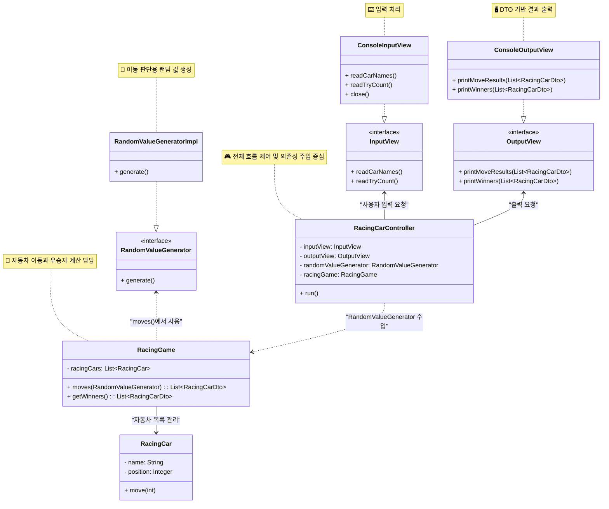

# java-racingcar-precourse

## 클래스 다이어그램

아래는 RacingCar 프로젝트의 클래스 관계를 요약한 UML 다이어그램입니다.



## 기능 목록

### 입력

- 경주할 자동차 이름
    - 이름은 쉼표로 구분한다.

```
경주할 자동차 이름을 입력하세요.(이름은 쉼표(,) 기준으로 구분)  
pobi,woni,jun
```

- 몇 번의 이동을 할 것인지 입력한다.

```
시도할 횟수는 몇 회인가요?  
5
```

### 비즈니스

#### 자동차 관리

- [x] 이름을 관리한다.
    - 이름은 1\~5사이의 문자이다.
    - 영어, 한글, 숫자, 문자 "-" 로 구성된다.
- [x] 위치를 관리한다.
    - 0\~9 사이의 값을 받으며, 무작위 값이 4 이상일 경우 전진한다.

예외 목록

| 분야          |   예시   | 이유                 |
  |-------------|:------:|:-------------------|
| 이름[입력]      | javaji | 글자수 초과             |
| 이름[입력]      |        | 공백                 |
| 이름[입력]      |   \\   | 허용되지 않은 형식         |
| 위치[입력]      |   -1   | 음수는 허용하지 않는다       |
| 위치 이동 매개 변수 |   10   | 매개변수 값의 범위는 0~9 이다 |

## 랜덤값 생성

- [x] 무작위 값을 생성한다
    - 값의 범위는 0~9 이다.

#### 게임 관리

- [x] 자동차들을 관리한다.
    - 중복된 이름의 자동차는 불가능하다.
- [x] n대의 자동차는 주어진 횟수동안 전진하거나 멈춘다.
    - 랜덤값 생성기를 이용하여 0\~9 사이의 값을 전달한다.
- [x] 우승자를 반환한다.
    - 우승자는 한 명 이상일 수 있다.
    - 우승자가 여러 명일 경우 쉼표`,`를 이용하여 구분한다.

예외 목록

| 분야 |     예시     | 이유     |
|----|:----------:|:-------|
| 이름 | yong, yong | 중복된 이름 |

### 출력

- 각 횟수마다 자동차들의 정보를 출력한다.

```
실행 결과
pobi : -
woni : 
jun : -

pobi : --
woni : -
jun : --

pobi : ---
woni : --
jun : ---

pobi : ----
woni : ---
jun : ----

pobi : -----
woni : ----
jun : ------

```

- 우승자의 정보를 출력한다.

```
최종 우승자 : pobi, jun
```

사용자가 잘못된 값을 입력할 경우 IllegalArgumentException을 발생시킨 후 애플리케이션은 종료되어야 한다.

## 구현 시 고민한 것들

### 랜덤값 생성 객체 왜 인터페이스로 구현했나?

`RacingCar::move` <- `RacingGame` 랜덤값을 생성해 전달합니다. 이때 랜덤값을 내부적으로 생성하는 것이 아닌 외부 인터페이스에 의존합니다.
`RacingGame`에서는 인터페이스 `RandomValueGenerator::generate`를 사용 하는데, 실제로 작동되는 코드는 외부에서 주입 해주는 구현체가 됩니다.

이렇게 설계 하게 된 이유는 **랜덤값**은 테스트가 어렵기 때문입니다.
어려운 랜덤값을 테스트 하기 보다는 테스트 하기 쉬운 값을 주입받을 수 있도록 하였습니다.
test를 진행할 때 `움직일 수 있는 값` 과 `움직일 수 없는 값`을 반환하는 객체 주입 함으로써 기능이 정상적으로 동작함을 보장할 수 있습니다.

### `RandomValueGenerator` 는 관리해야 하는 객체인가?

```java
public class RacingGame {
    private final List<RacingCar> racingCars;
    private final RandomValueGenerator randomValueGenerator;

    public RacingGame(List<RacingCar> racingCars, RandomValueGenerator randomValueGenerator) {
        this.racingCars = racingCars;
        this.randomValueGenerator = randomValueGenerator;
    }

    public List<RacingCarDto> moves() {
        racingCars.forEach(racingCar ->
                racingCar.move(randomValueGenerator.generate()));
    ...
    }
  
  ...
}
```

저는 위와 같이 생성자에서 주입을 받아서 랜덤값 생성기를 이용 했습니다.
이렇게 구현할 경우 사용이 간편하지만, 두가지 문제가 있었습니다.

1. `RandomValueGenerator`를 관리하는것이 `RacingGame`의 책임인가?
2. `RacingGame::moves()` 함수 외에는 해당 객체를 사용하지 않는다.
3. 테스트를 진행할 때 각 `RacingGame::moves()` 에 원하는 동작을 실행시키기 어렵다. -> 테스트하기 어렵다

테스트를 진행하기 위해서는 `RacingGame`을 생성하는 모든 시점에서 `RandomValueGenerator`를 만들고 주입을 해줘야 합니다. 하지만 이는 불 필요한 일 입니다.
또한 `RacingGame::moves()`를 테스트 할때 `움직일 수 있는 값`,`움직일 수 없는 값` 두 가지를 테스트 하기가 어려웠습니다.

결론적으로 RandomValueGenerator 의 관리 책임은 RacingCarGame 에 있지 않다고 생각 했고, 아래와 같이 구성했습니다.

```java
public class RacingGame {
    private final List<RacingCar> racingCars;

    public RacingGame(List<RacingCar> racingCars) {
        this.racingCars = racingCars;
    }

    public List<RacingCarDto> moves(final RandomValueGenerator randomValueGenerator) {
        racingCars.forEach(racingCar ->
                racingCar.move(randomValueGenerator.generate()));

        ...
    }
    
    ...
}
```

함수에서 객체를 주입받아 사용함으로써 관리책임에서 벗어나고 로직에만 집중할 수 있게 되었습니다.
더 쉽게 테스트 할 수 있게 되었고, 기능이 정상적으로 동작 함을 보증할 수 있게 되었습니다.

>
참고한것 : [DIP 원칙](https://inpa.tistory.com/entry/OOP-%F0%9F%92%A0-%EC%95%84%EC%A3%BC-%EC%89%BD%EA%B2%8C-%EC%9D%B4%ED%95%B4%ED%95%98%EB%8A%94-DIP-%EC%9D%98%EC%A1%B4-%EC%97%AD%EC%A0%84-%EC%9B%90%EC%B9%99)

### 예외처리 문구 관리

저는 무분별하게 흩어져 있는 예외 문구를 관리할 필요가 있다고 생각했습니다.
왜냐하면 예외 문구는 사용자에게 직접 보여져야 하는 것이기 때문입니다.

디스코드 함께 나누기에 있던 [예외 팩토리 패턴](https://youngi2.tistory.com/14) 을 이용하여 예외처리 문구를 관리해 보았습니다.